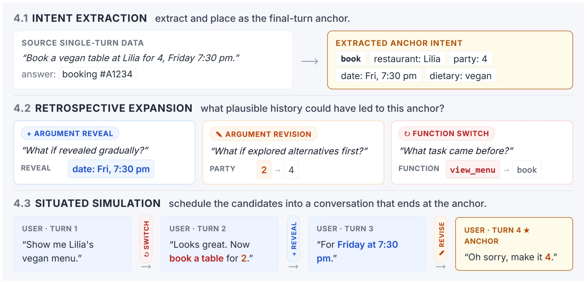
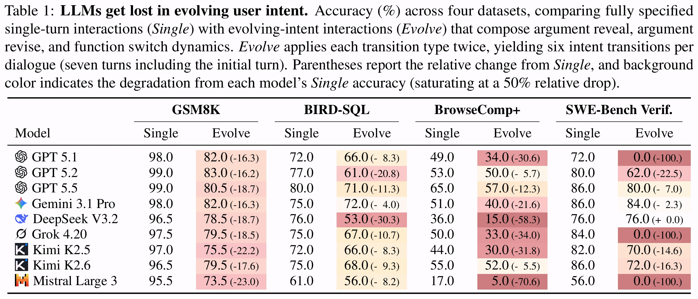

# LLMs Get Lost in Evolving User Intent

> [!IMPORTANT]
> This is an independent reproduction workspace based on Microsoft Research's
> [`microsoft/evolving-intent`](https://github.com/microsoft/evolving-intent)
> at commit
> [`993d6be`](https://github.com/microsoft/evolving-intent/commit/993d6be9597ac03854b46362ccd647eb1bfd267a).
> It is not an official Microsoft repository. Reproduction-specific setup,
> fixes, experiment manifests, and results are documented in
> [`REPRODUCTION.md`](REPRODUCTION.md).

## 复现结果速览（2026-08-19）

> 复现全程锁定 **Kimi K2.6**（构建 / 评测 / judge / naturalizer，reasoning=medium），对照论文 Table 1 的 Kimi K2.6 行（arXiv 2607.20734）。Evolve = T7 轮、每类 intent transition 各两次（argument reveal / revision / function switch）。

| Benchmark | 样本（论文 / 复现） | 论文 K2.6 Single → Evolve | 复现 Single → Evolve | 判定 |
|---|---|---:|---:|---|
| BIRD-SQL | 100 / 100 | 75.0 → 68.0（−9.3%） | **69.0 → 45.0（−34.8%）** | ✅ 方向复现，幅度越过论文 9 模型区间（−4.0% ~ −30.3%）的上界 |
| SWE-bench Verified | 50 / 50 | 86.0 → 72.0（−16.3%） | 78.0 → 76.0（−2.6%） | ✅ 方向复现，落在论文跨模型离散带内（+0.0% ~ −100%） |
| GSM8K | 200 / 10 | 96.5 → 79.5（−17.6%） | 90.0 → 90.0（±0.0%） | ⚠️ n=10 无判定力（Wilson 95% 区间互相重叠） |
| BrowseComp+ | 100 / — | 55.0 → 52.0（−5.5%） | 未评测 | ⛔ 构建停止于 stage 3（10/100），checkpoint 可恢复 |

**一句话结论**：论文中心现象（fully-specified → evolving-intent 的 "getting lost" 退化）在 BIRD-SQL 上以超论文幅度强复现、在 SWE 上方向性复现；域间退化模式与论文（Search/SWE 最重、SQL 温和）倒挂；论文全部机制性分析（Table 2 场景分解、Figure 4–7、Table 3 intent tracking）未覆盖。最大混杂变量：论文用 GPT 5.1 构建、本复现按协议全程用 kimi-k2.6 构建。

深入阅读：

- [复现 vs 论文详细对比](reproduction/PAPER_COMPARISON.md) — 逐表逐图对照、相同点 / 不同点、归因注意
- [机读汇总报告 JSON](reproduction/remaining_experiments_report.json) · [HTML 报告](reproduction/remaining_experiments_report.html) — 覆盖率 / 准确率 / 费用 / 模型审计
- [运行手册与故障复盘](reproduction/reproduction_runbook_2026-08-15.html) — 不可变实验条件、验收顺序、已知故障与修正
- [Plan A GSM8K 小样本协议与结果](REPRODUCTION.md) · [SWE 评测细节](evaluation/SWE_README.md)

质量线：165 pytest + 32 subtests 全绿；评测与构建全程 usage 记账（无费用上限），账本随结果入库。

## 本仓库结构（复现增量）

在上游三件套（`intent_construction/` 数据构建、`situated_simulation/` 用户模拟、`evaluation/` 评测）之上，本仓库增加了：

```
reproduction/                     # 复现专用层
├── PAPER_COMPARISON.md           # ★ 复现 vs 论文对比（首页表格的详细版）
├── remaining_experiments_report.{json,html}  # finalizer 生成的汇总报告
├── reproduction_runbook_2026-08-15.html      # 运行手册（实验条件与故障复盘）
├── plan_2026-08-14.html          # 最初规划文档
├── config/                       # 真值源：paper_remaining_kimi_k2_6.json
├── run_with_cc_switch.py         # 凭据装载器（cc-switch DB → 进程内存）
├── finalize_remaining_experiments.py         # 终局校验 + 报告生成
├── browsecomp_construction_modal.py          # BrowseComp+ Modal 构建（detached）
└── runs/                         # 各 benchmark 的 manifest / usage 账本 / 审计

evaluation/
├── experiments/                  # BIRD 逐样本结果（含 compact 精简版）
└── swe_runs/kimi-k2.6/           # SWE manifest / results / usage.jsonl
```

BrowseComp+ 明文 query 与 gold 文档仅存于私有 Modal Volume 与本地 gitignored 目录，永不入库。

---

A research project from [Microsoft Research, AI Interaction and Learning (AIIL)](https://www.microsoft.com/en-us/research/group/ai-interaction-and-learning/).

Authors: [Jihoon Tack](https://jihoontack.github.io/), [Philippe Laban](https://tingofurro.github.io/), [Jennifer Neville](https://jenneville.github.io/)

[](https://www.microsoft.com/en-us/research/) [](LICENSE) [](https://arxiv.org/abs/2607.20734)

---

## Overview

<p align="center">
  
</p>

This work studies how well LLMs track and act on
user intent as it *evolves* over a conversation. Genuine interaction is
inherently dynamic: users rarely specify their intent upfront, instead
disclosing, revising, and at times redirecting it as the dialogue unfolds. Yet
LLMs are still predominantly evaluated and trained in single-turn,
fully-specified settings, leaving open a fundamental question—*how well do LLMs
follow user intent as it changes across turns?* To study this, our framework
transforms static, single-turn tasks into dynamic multi-turn conversations in
which the user's intent evolves across turns—incrementally revealed, revised,
and sometimes redirected mid-conversation—while preserving each task's original
evaluation protocol.

## Contents

- [复现结果速览](#复现结果速览2026-08-19)
- [Overview](#overview)
- [Results](#results)
- [Installation](#installation)
- [Core Concepts](#core-concepts)
- [Directory Structure](#directory-structure)
- [Framework](#framework)
- [Documentation](#documentation)
- [Contributing](#contributing)
- [Trademarks](#trademarks)
- [Citation](#citation)

## Results

### This reproduction

The four-benchmark comparison against the paper's Table 1 (Kimi K2.6 row) is
at the top of this page — see [复现结果速览](#复现结果速览2026-08-19) and the
[detailed comparison](reproduction/PAPER_COMPARISON.md). Current evidence:
BIRD-SQL reproduces the evolving-intent degradation at a magnitude exceeding
every model in the paper (−34.8% relative); SWE-bench Verified reproduces the
direction (−2.6%) inside the paper's cross-model spread; GSM8K is
inconclusive at n=10; BrowseComp+ evaluation is not run (construction stopped
at stage 3, resumable). Protocol fidelity notes: identical T=7 / two
transitions per type setting, medium reasoning, native verifiers, Kimi K2.6's
paper-specific 200 tool calls per turn on SWE; construction model differs by
design (kimi-k2.6 instead of the paper's GPT 5.1).

### Paper results

We evaluate LLMs across multiple benchmarks under a single-turn
(static) setting and our evolving-intent setting. Even strong models degrade
substantially as user intent evolves over the conversation—after only a few
intent transitions.

<p align="center">
  
</p>

## Installation

```bash
# Create and activate conda environment
conda create -n evolvingintent python=3.10 -y
conda activate evolvingintent

# Install dependencies
pip install -r requirements.txt

# Install the project as an editable package (enables `import evaluation`,
# `import intent_construction`, `import situated_simulation` from any directory)
pip install -e .
```

### API keys

Model calls go through the OpenAI Python SDK against either Azure OpenAI or
OpenAI. Configure credentials via environment variables:

```bash
# Option A — Azure OpenAI
export AZURE_OPENAI_API_KEY="..."
export AZURE_OPENAI_ENDPOINT="https://<your-resource>.openai.azure.com"
# Optional: map model ids to your Azure deployment names (JSON)
export AZURE_OPENAI_DEPLOYMENT_MAP='{"gpt-5.1": "my-gpt51-deployment"}'

# Option B — OpenAI
export OPENAI_API_KEY="sk-..."
```

When both are set, choose explicitly with `LLM_BACKEND=openai` or
`LLM_BACKEND=azure`. The Azure API versions can be overridden via
`AZURE_OPENAI_API_VERSION` and `AZURE_OPENAI_RESPONSES_API_VERSION`.

### Quick Test

```bash
# Test extraction pipeline
cd intent_construction/intent_extraction
python generate.py --dataset gsm8k --num_samples 3 --split test --output output/test.json
```

## Core Concepts

Instead of creating datasets from scratch (expensive and time-consuming), we transform existing benchmarks into dynamic environments by decomposing problems into their fundamental components:

### Terminology

| Term | Description |
|------|-------------|
| `function` | The main question to answer |
| `argument_id: 1, 2, ...` | Arguments needed to solve the problem |

## Directory Structure

```
evolving-intent/
├── intent_construction/        # Data construction (Stages 1-3)
│   ├── intent_extraction/      # Stage 1: function & argument extraction
│   ├── retrospective_expansion/
│   │   ├── counterfactual/     # Stage 2: argument counterfactual
│   │   └── predecessor/        # Stage 3: function predecessor
│   ├── eval_indices/           # Fixed evaluation subsets (source IDs)
│   ├── scripts/                # Per-dataset pipeline runners
│   └── README.md               # Data construction guide
│
├── situated_simulation/        # User-simulation builder
│   ├── user_simulation.py      # DataLoader-like user-simulation interface
│   ├── turn_scheduler.py       # Plan-first turn scheduler
│   └── README.md
│
└── evaluation/                 # Evaluation
    ├── runners/                # Experiment runners (per domain)
    ├── common/                 # Shared utilities
    ├── scripts/                # Per-dataset eval scripts
    ├── experiments/            # Results by scenario
    └── SWE_README.md           # SWE-bench evaluation details
```

## Framework

### Supported Datasets

| Category | Dataset | Status |
|----------|---------|--------|
| Simple math | GSM8K | ✅ Done |
| Text-to-SQL | BIRD-SQL | ✅ Done |
| Agentic search | BrowseComp+ | ✅ Done |
| Software engineering | SWE-Bench Verified | ✅ Done — see [evaluation/SWE_README.md](evaluation/SWE_README.md) |

### Data Construction (`intent_construction/`)

Transforms existing benchmarks into structured data through three stages
(followed by user-simulation build and evaluation as Stages 4-5 of the overall pipeline):

| Stage | Module | Description |
|-------|--------|-------------|
| 1 | `intent_extraction/` | Decompose problems into Function + Arguments + Answer |
| 2 | `retrospective_expansion/counterfactual/` | Generate value variants of arguments |
| 3 | `retrospective_expansion/predecessor/` | Generate related but different functions |
| 4 | `situated_simulation/` | Assemble multi-turn conversations from counterfactual data |
| 5 | `evaluation/` | Run models, score answers, analyze results |

**Quick Start**:
```bash
# Run a dataset's full construction pipeline (example: GSM8K)
# Args: workers model num_counterfactuals num_predecessors
./intent_construction/scripts/gsm8k.sh 20 gpt-5.1 4 3
```

See [intent_construction/README.md](intent_construction/README.md) for detailed documentation.

### User Simulation (`situated_simulation/`)

Construct multi-turn conversation samples with dynamic argument/function changes.

**Scenarios**:
| Scenario | Description |
|----------|-------------|
| `fully-specified` | All info in 1 turn (baseline) |
| `argument-reveal` | Arguments revealed incrementally across turns, no changes (the under-specified setting) |
| `argument-revision` | Arguments change mid-conversation; LLM must track corrections |
| `function-switch` | Functions change mid-conversation; LLM must adapt to new questions |
| `combined` | Argument reveals, argument revisions, and function switches can all occur in the same conversation |

Scenario is auto-inferred from `num_turns` / `num_revisions` /
`num_switches`; you don't pass it explicitly.

**Example Usage**:
```python
from situated_simulation.user_simulation import EvolvingIntent

sim = EvolvingIntent(
    data_path="final_dataset/gsm8k_final.json",
    mode="eval",
    num_turns=4,
    num_revisions=2,  # → auto-inferred as "argument-revision"
)

for sample in sim:
    turns = sample.turns      # Multi-turn conversation
    label = sample.label      # Ground truth answer
```

**Key Features**:
- DataLoader-like interface (`__len__`, `__getitem__`, `__iter__`)
- Eval mode (deterministic) and train mode (random sampling)
- Online naturalization: optionally rephrase turns via `--naturalizer_model`

See [situated_simulation/README.md](situated_simulation/README.md) for details.

### Evaluation (`evaluation/`)

Run experiments using OpenAI / Azure OpenAI API calls.

**Features**:
- API-based evaluation pipeline (`runners/`)
- Multi-model comparison
- Per-dataset scripts that run a single-turn baseline and an evolving-intent scenario (`scripts/run_{gsm8k,bird,browsecomp,swe}.sh`)
- Online naturalization support: `--naturalizer_model gpt-5.1`

See [evaluation/README.md](evaluation/README.md) for details.

## Documentation

- [Intent Construction](intent_construction/README.md) - Extraction & Counterfactual stages
- [User Simulation](situated_simulation/README.md) - User-simulation interface
- [Evaluation](evaluation/README.md) - Running evaluations

## Contributing

This project welcomes contributions and suggestions.  Most contributions require you to agree to a
Contributor License Agreement (CLA) declaring that you have the right to, and actually do, grant us
the rights to use your contribution. For details, visit [Contributor License Agreements](https://cla.opensource.microsoft.com).

When you submit a pull request, a CLA bot will automatically determine whether you need to provide
a CLA and decorate the PR appropriately (e.g., status check, comment). Simply follow the instructions
provided by the bot. You will only need to do this once across all repos using our CLA.

This project has adopted the [Microsoft Open Source Code of Conduct](https://opensource.microsoft.com/codeofconduct/).
For more information see the [Code of Conduct FAQ](https://opensource.microsoft.com/codeofconduct/faq/) or
contact [opencode@microsoft.com](mailto:opencode@microsoft.com) with any additional questions or comments.

## Trademarks

This project may contain trademarks or logos for projects, products, or services. Authorized use of Microsoft
trademarks or logos is subject to and must follow
[Microsoft's Trademark & Brand Guidelines](https://www.microsoft.com/legal/intellectualproperty/trademarks/usage/general).
Use of Microsoft trademarks or logos in modified versions of this project must not cause confusion or imply Microsoft sponsorship.
Any use of third-party trademarks or logos are subject to those third-party's policies.

## Citation

If you find our work useful, please consider citing:

```bibtex
@article{tack2026llms,
    title={LLMs Get Lost in Evolving User Intent},
    author={Tack, Jihoon and Laban, Philippe and Neville, Jennifer},
    journal={arXiv preprint arXiv:2607.20734},
    year={2026},
}
```
